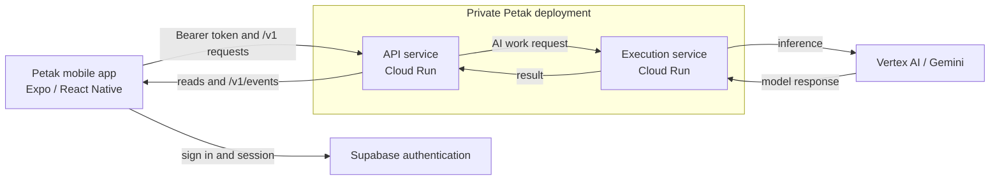
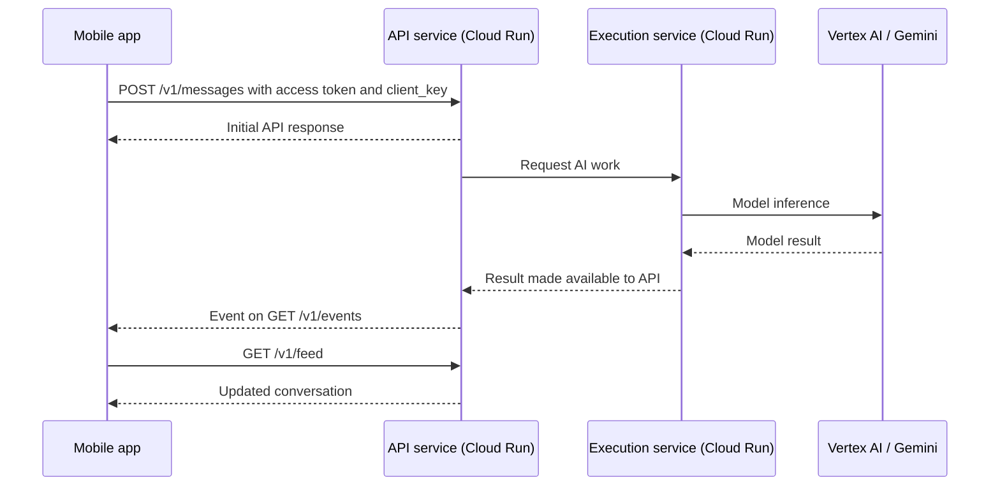
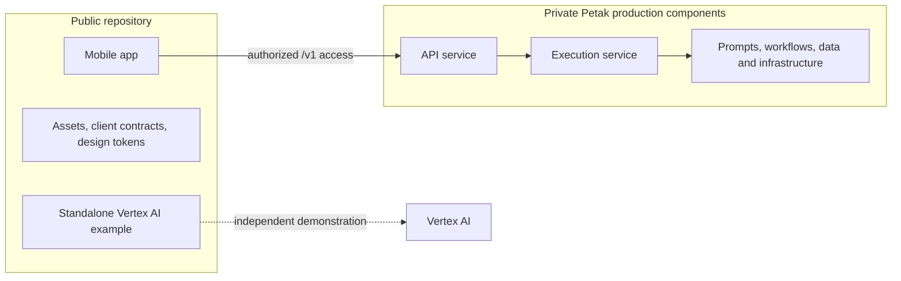

# Petak architecture

Petak's mobile app turns messages and photos into conversations and organized records. The client is public in this repository. The deployed Petak API and AI execution services are private. This document describes their **integration boundaries**, not their internal implementation or a deployable backend.

## Components and ownership

| Component | Responsibility | In this repository? |
|---|---|---|
| Mobile app (Expo / React Native) | Sign-in UI, message and photo capture, local pending work, conversation, progress, and dashboards | Yes: [`apps/app`](../apps/app/README.md) |
| Supabase authentication | User session and access token used by the client | External service; client integration only |
| Petak API service (Cloud Run) | Authenticated `/v1` interface, client reads and writes, and event delivery | No |
| Petak execution service (Cloud Run) | Backend-side AI work requested through the API | No |
| Vertex AI / Gemini | Managed model inference called by the backend side | Google Cloud service; no direct app call |
| Standalone Vertex AI example | Minimal, independent Cloud Run-to-Vertex request | Yes: [`examples/vertex-ai-demo`](../examples/vertex-ai-demo/README.md) |

## Authentication and API boundary

The app signs in through Supabase. Its API adapter retrieves the current session access token and sends it as `Authorization: Bearer` to the Petak API origin configured by `EXPO_PUBLIC_API_URL`. The API is the client's only Petak backend entry point. The public code shows the caller's request and response shapes; it does not define server authorization rules or expose the private implementation. See the [client API contract](api-contract.md).

## AI request and result flow

Text and photo actions reach the API first. Work that needs AI processing is handled asynchronously by the private execution service, which calls Gemini through Vertex AI. The app can receive an initial response before later AI results are available. It keeps the conversation current through `/v1/events` server-sent events and subsequent API reads. Events notify the app to refresh relevant data; they are not the sole source of record.

For a photo, the client first creates a photo record, uploads bytes to a temporary URL provided by the API, sends the related message, and calls the photo acceptance endpoint. It can then observe the public capture progress states and refreshed conversation. The arrows show logical responsibilities, not a disclosed transport or storage design; scheduling and persistence details remain private.

## Public repository boundary

The example is **representative of one Google Cloud integration pattern**. It is not connected to the mobile app and does not implement Petak's production orchestration. An authorized deployed backend is required for end-to-end product evaluation. See [private production components](proprietary-components.md) and the [judge demo flow](demo-flow.md).
